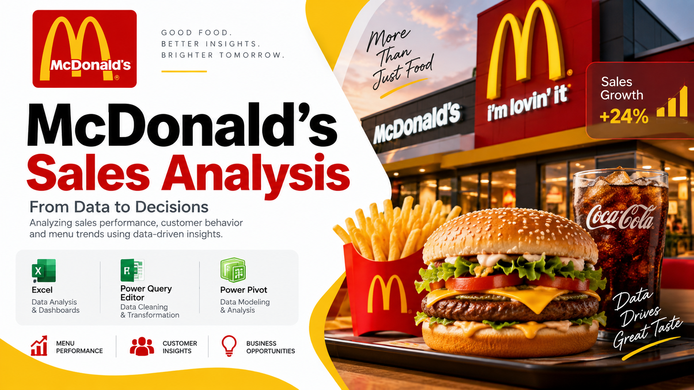

# 🍔 McDonald's Sales Analysis | Excel Business Analyst Project

## 📌 Project Overview

## 📊 Dashboard Preview

This project analyzes McDonald's sales and order-detail data to uncover patterns in:

- Revenue performance
- Menu-item performance
- Order volume
- Time-based ordering behaviour
- Meal-period sales
- Day-wise sales trends

The project follows a complete Business Analyst workflow:

**Raw Data → Data Cleaning → Data Modeling → Analysis → Visualization → Dashboard → Insights**

---

## 🎯 Business Objective

The objective was to transform transactional sales data into actionable business insights that can help understand:

- Which categories generate the most revenue?
- Which menu items are ordered most frequently?
- Which items generate the highest revenue?
- How does revenue vary across months?
- How does order volume change by hour and day?
- Which meal periods contribute most to sales?
- Which menu items make up the top revenue contributors?

---

## 🛠️ Tools Used

### 📗 Excel
Used for:
- Data analysis
- PivotTables
- PivotCharts
- KPI calculations
- Dashboard development

### 🧹 Power Query Editor
Used for:
- Data cleaning
- Data transformation
- Duplicate checks
- Handling missing values
- Preparing analytical columns

### 🔄 Power Pivot
Used for:
- Data modeling
- Relationships between tables
- Calculated columns
- Measures
- Distinct-count analysis

---

## 🗂️ Workbook Structure

### `mcdonalds_menu_items`
Contains:
- Menu Item ID
- Item Name
- Category
- Price

### `order_details`
Contains:
- Order Details ID
- Order ID
- Order Date
- Order Time
- Item ID
- Item Name
- Category
- Price
- Month
- Hour
- Day Name
- Day Type
- Supporting calculated fields

### `Pivots`
Contains the analytical PivotTables used to answer the business questions.

### `Dashboard`
Interactive dashboard containing:
- KPI cards
- Revenue analysis
- Order-volume analysis
- Top 5 menu items
- Meal-period analysis
- Day-wise trends
- Date timeline
- Category slicer

---

## 🔎 Key Business Questions

1. 💰 What is the total sales revenue for each category?
2. 📅 How many orders are placed each day?
3. 🍔 Which menu item is most frequently ordered?
4. 💵 What is the total revenue generated by menu items?
5. 📈 How does category revenue compare across months?
6. 🧺 What is the average number of items per order?
7. ⏰ How does order volume vary by hour?
8. 📆 How do sales vary by day of the week?
9. 📊 How does sales volume vary by category across months?
10. 🏆 What are the top 5 menu items by revenue?

---

## 📊 Dashboard KPIs

💰 **Total Revenue:** $61,626.29

🍟 **Items Sold:** 12,234

🧾 **Orders Placed:** 5,370

🛒 **Average Items / Order:** 2.28

🥗 **Top-Selling Item by Order Volume:** Side Salad

---

## 🔍 Key Findings

### 💰 Revenue Performance
Burger generated the highest category revenue at **$21,639.01**, representing approximately **35.1%** of total revenue.

### 🏆 Top Revenue Items
The top 5 menu items by revenue were:

- Meatball Marinara — $4,261.26
- Angus Third Pounder — $3,995.00
- Quarter Pounder with Cheese — $3,965.36
- Bulgogi Burger — $3,842.08
- Big Mac — $3,731.77

Together, these five items contributed approximately **32.1% of total revenue**.

### 🥗 Most Frequently Ordered Item
Side Salad recorded the highest order volume with **631 item-level transactions**.

### ⏰ Peak Ordering Hour
The highest order volume occurred at **12 PM**, with **647 distinct orders**.

### 🍽️ Meal Period
Lunch accounted for **41%** of sales, followed by Dinner at **39%**.

### 📅 Day-wise Sales
Wednesday recorded the lowest total revenue at approximately **$7,625.56**, or **12.4% of total revenue**.

---

## 💡 Business Implications

📌 Focus on high-revenue categories and menu items when evaluating promotions.

📌 Examine lunch and other high-volume periods for staffing and inventory planning.

📌 Investigate lower-performing periods such as Wednesday and breakfast for possible demand-generation opportunities.

📌 Use monthly category trends to understand which parts of the menu remain consistent versus those that fluctuate.

---

## 📈 Skills Demonstrated

- Excel
- Power Query
- Power Pivot
- Data Cleaning
- Data Transformation
- Data Modeling
- PivotTables
- PivotCharts
- KPI Development
- Business Analysis
- Data Visualization
- Dashboard Design
- Insight Generation

---

## 📎 Project Files

📊 Excel Workbook  
📑 Presentation  
🖼️ Dashboard Preview

---

## 🚀 Project Outcome

This project demonstrates the complete process of turning transactional sales data into a structured analytical solution—from data preparation and modeling through dashboard development and business insights.
